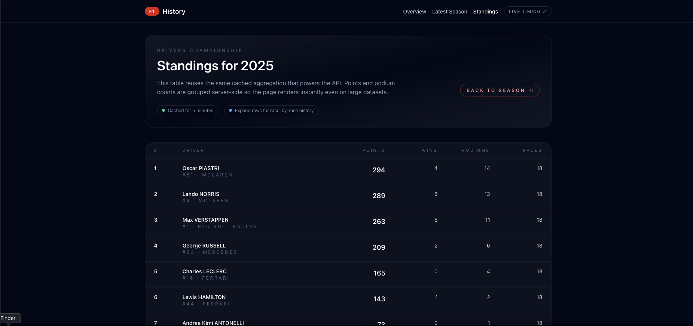

<div align="center">
    
    <h1>F1 History</h1>
    <p>A passion project built from an incurable love of Formula 1.</p>
</div>

---

> This app exists because I wanted an excuse to tinker with race data every weekend

> ⚠️ **Project status:** work-in-progress. Major features are still being built out while the data layer settles in.

## 🚦 Tech Stack

- **Laravel 11** – API layer, background jobs, caching, blade-powered UI  
- **MySQL 8** – Long-term store for meetings, sessions, laps, stints, and standings  
- **Vite + Tailwind CSS + Alpine.js** – Fast, modern frontend with a lightweight sprinkle of interactivity  
- **Docker / Laravel Sail** – Local environment parity with production  
- **Testing** – Feature coverage for the public API endpoints via PHPUnit

All race information comes from the amazing [OpenF1 API](https://api.openf1.org/). They make real timing and classification data freely available—this project just gives it a friendly face.

## 🏁 What You Can Do

1. **Browse any imported season**  
   Check the overview, full calendar, race classifications, stints, and driver profiles. All heavy queries are cached server-side for quick navigation.

2. **Consume the structured API**  
   Everything powering the UI is exposed under `/api/v1`:
   - `GET /api/v1/seasons`  
   - `GET /api/v1/seasons/{year}`  
   - `GET /api/v1/seasons/{year}/standings`  
   - `GET /api/v1/races/{meeting}` (+ `/stints`)  
   - `GET /api/v1/drivers/{number}`

3. **Keep it fresh**  
   The importer pulls new data season by season. Re-running it is idempotent, so it’s safe to schedule as often as you like.

## 🛠️ Getting Started

These steps assume macOS/Linux. Windows users can lean on WSL2.

```bash
# 1. Clone
git clone https://github.com/nelsoncgsantos/f1-history.git
cd f1-history

# 2. Environment
cp .env.example .env
php artisan key:generate

# 3. Dependencies
composer install
npm install

# 4. Spin up Sail (Docker)
./vendor/bin/sail up -d

# 5. Run migrations
./vendor/bin/sail artisan migrate

# 6. Import a season
./vendor/bin/sail artisan f1:import 2024

# 7. Start the dev server
npm run dev
# → Visit http://localhost
```

Need more years? Repeat the import command with any season OpenF1 supports:

```bash
./vendor/bin/sail artisan f1:import 2023
./vendor/bin/sail artisan f1:import 2022
```

<div align="center">
    
</div>

*Latest standings view (work in progress while the UI continues to evolve).*

## 📦 Build for Production

```bash
php artisan optimize:clear
php artisan migrate --force
php artisan f1:import 2024
npm run build
php artisan config:cache
php artisan route:cache
```

Point Nginx/Apache at `public/`, ensure `storage/` and `bootstrap/cache/` are writable, and set up a cron entry for `php artisan schedule:run` to keep the active season updated.

## ❤️ Why This Exists

Formula 1 has been my obsession since childhood. This project is a way to explore the data that gets me out of bed on race day, and to share it with other fans who can’t resist comparing stints, lap charts, or that one alternate strategy that almost worked.

Big thanks to [OpenF1](https://api.openf1.org/) for the free and incredibly detailed timing feed. Without them, this project would still be scribbles on pit-wall paper.

Feel free to fork, extend, or just enjoy the history. See you on race day. 🏎️💨
